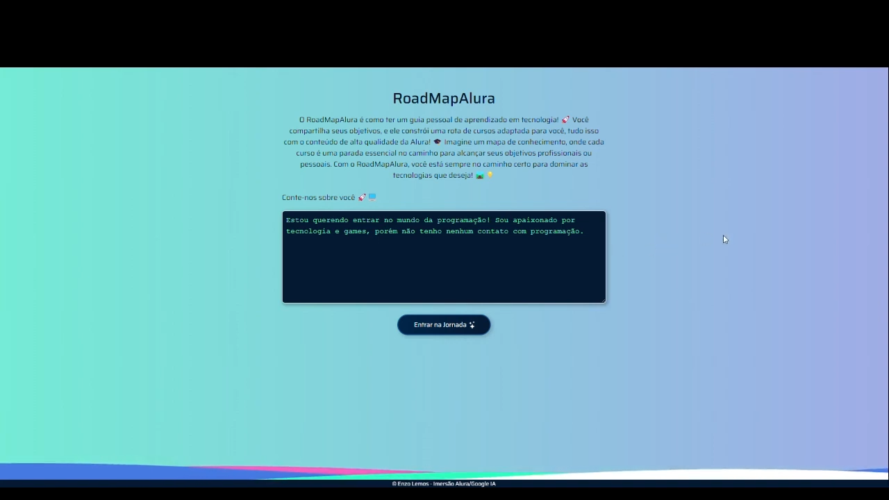
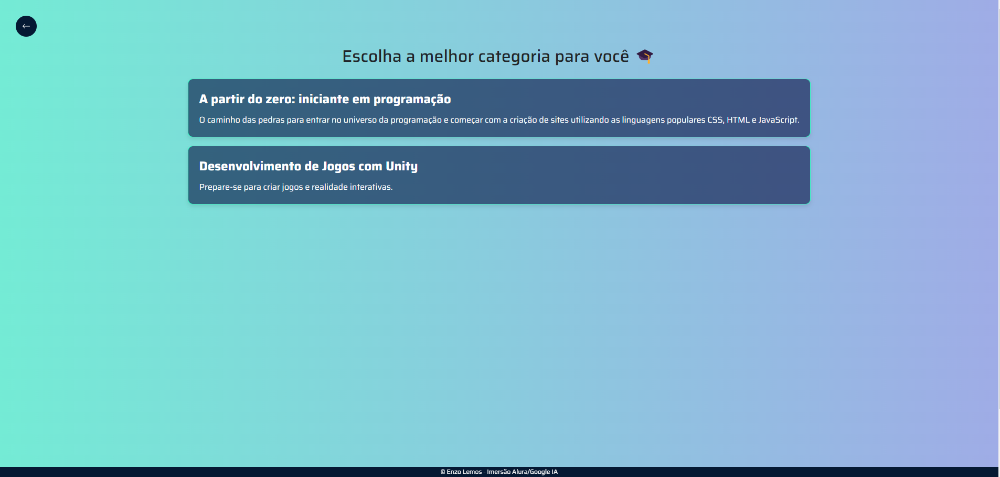
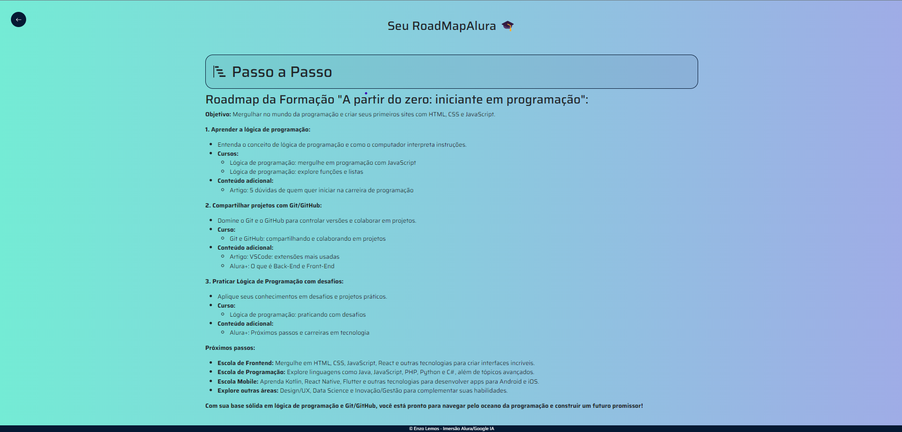
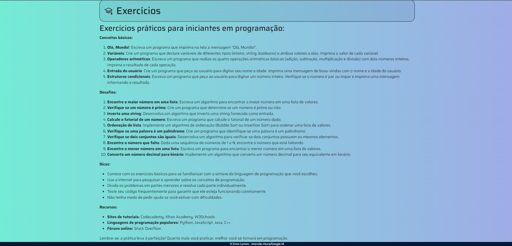
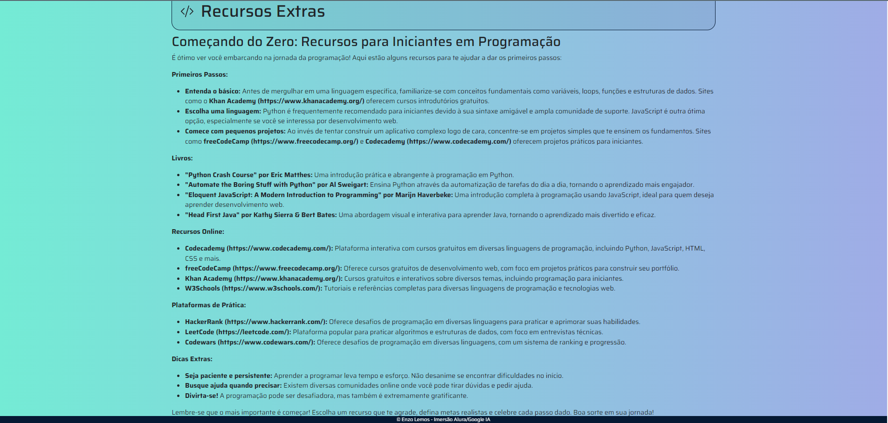

# RoadMapAlura

Desenvolvi esse projeto com insparação no [roadmap](https://www.roadmap.sh). Quando estava começando a aprender, me deparei com uma infinidade de recursos disponíveis online. Embora fosse incrível ter tantas opções, também enfrentei dificuldades para escolher um caminho de aprendizado devido à variedade de tecnologias, frameworks e linguagens, além das diferentes nomenclaturas utilizadas. Vi uma oportunidade construindo esse projeto de desenvolver um Guia para as pessoas que estão iniciando nessa área. Essa plataforma vai ajudar você a evitar a sobrecarga de opções e a navegar de forma mais clara por esse vasto universo da tecnologia. O RoadMapAlura leva em consideração seus objetivos pessoais e profissionais, fornecendo uma rota de aprendizado personalizada que utiliza o conteúdo de alta qualidade da Alura.

O RoadMapAlura é como ter um guia pessoal de aprendizado em tecnologia! 🚀 Você compartilha seus objetivos, e ele constrói uma rota de cursos adaptada para você, tudo isso com o conteúdo de alta qualidade da Alura! 🎓 
Imagine um mapa de conhecimento, onde cada etapa é uma parada essencial no caminho para alcançar seus objetivos profissionais ou pessoais. Com o RoadMapAlura, você está sempre no caminho certo para dominar as tecnologias que deseja! 🛤️💡

Este repositório contém:

- [ ] Lista de cursos recomendados para diferentes objetivos
- [ ] Guia passo a passo para utilizar o RoadMapAlura
- [ ] Exercícios para cada objetivo específico
- [ ] Recursos adicionais para auxiliar no seu aprendizado

## Como usar o RoadMapAlura:

1. **Clone o repositório:**
   - Faça o clone deste repositório para o seu ambiente local usando o seguinte comando:
     ```
     git clone git@github.com:Enzolp2/RoadmapAlura_AI.git
     ```

2. **Crie e ative uma virtual environment do Python:**
   - Navegue até o diretório clonado do RoadMapAlura e crie uma virtual environment utilizando o seguinte comando (certifique-se de ter o Python e o virtualenv instalados):
     ```
     python -m venv venv
     ```
   - Em seguida, ative a virtual environment. As instruções podem variar de acordo com o sistema operacional:
     - No Windows:
       ```
       venv\Scripts\activate
       ```
     - No macOS e Linux:
       ```
       source venv/bin/activate
       ```

3. **Instale as dependências:**
   - Com a virtual environment ativada, use o pip para instalar as dependências do projeto listadas no arquivo `requirements.txt`. Execute o seguinte comando:
     ```
     pip install -r requirements.txt
     ```

4. **Crie um arquivo .env e defina as variáveis de ambiente:**
   - No diretório raiz do projeto, crie um arquivo chamado `.env`.
   - Dentro do arquivo `.env`, defina as duas variáveis de ambiente necessárias para o projeto:
     ```
     GOOGLE_API_KEY=sua_chave_api_do_Google
     SECRET_KEY=sua_chave_secreta
     ```
   - Substitua `sua_chave_api_do_Google` pela sua chave de API do Google e `sua_chave_secreta` por uma chave secreta de sua escolha para o Flask.

5. **Execute o aplicativo:**
   - Com as dependências instaladas e as variáveis de ambiente configuradas, você pode executar o aplicativo. Certifique-se de estar no diretório raiz do projeto e execute o seguinte comando:
     ```
     python flask run
     ```
   - Isso iniciará o servidor Flask. Você poderá acessar o RoadMapAlura em seu navegador, geralmente em `http://localhost:5000/`.

## Criando um RoadMapAlura
[Video demonstração do RoadMapAlura](https://youtu.be/ux3bL8XcXX0)

Basicamente você fornece uma descrição sobre você. Dizendo quais são seus gostos, objetivos, etc


A aplicação vai encontrar para você duas categorias que mais se encaixam com seu objetivo


Ao clicar na categoria que você mais gostar, iniciará a busca pelo melhor RoadMapAlura com base na sua descrição e na categoria escolhida
No RoadMapAlura tem três áreas.

- Passo a Passo


- Exercícios


- Recursos Adicionais



## Agradecimentos
Um agradecimento especial à equipe da Alura por fornecer um conteúdo de alta qualidade e inspirar este projeto. Suas contribuições para a educação são memoráveis.
Obrigado a todos! 🚀


